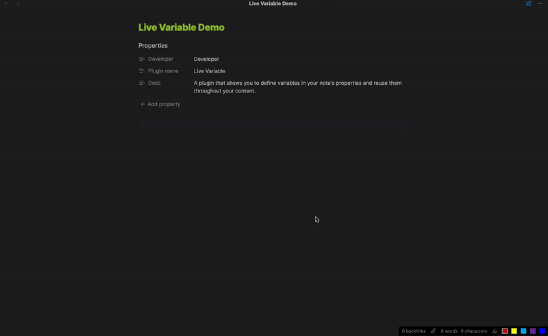

# Obsidian Sample Plugin

The Live Variables Plugin for Obsidian helps you manage and reuse data within your notes by allowing you to define variables in your note's properties. When you change the value of a variable, all occurrences of that variable in your note are automatically updated. This ensures consistency and can save you time when working with frequently changing information.

## Features
- Dynamic Variable Management: Define variables in your note's properties and update them with ease. All instances of the variable in your note will update automatically.
- Seamless Integration: Fully integrated into the Obsidian environment, enhancing your note-taking experience.
- Efficiency Boost: Reduce the need for manual updates of repeated information.
- User-Friendly Interface: Intuitive setup and management of variables.

# Usage

1. Install the Plugin:

- Download the plugin from the GitHub repository.
- Place the plugin folder in your Obsidian plugins directory.
- Enable the plugin in the Obsidian settings.

2. Define Variables:

- Open the note where you want to use variables.
- In the note's properties, define your variables. For example
  ```
  ---
    projectName: Obsidian Live Variables Plugin
    dueDate: 2024-12-31
  ---
  ```

3. Use Variables in Your Note:
You can referance a variable with the comand `Live Variable: Insert live variable` and then choose you variable.

4. Update Variables:
Change the value of the variables in the note's properties, and all occurrences of the variables in the note will be updated automatically.

## Demo
To see the plugin in action, check out the following demo:



## Contributing
Contributions are welcome! If you have suggestions for improvements or new features, please open an issue or submit a pull request.

## License
This project is licensed under the MIT License